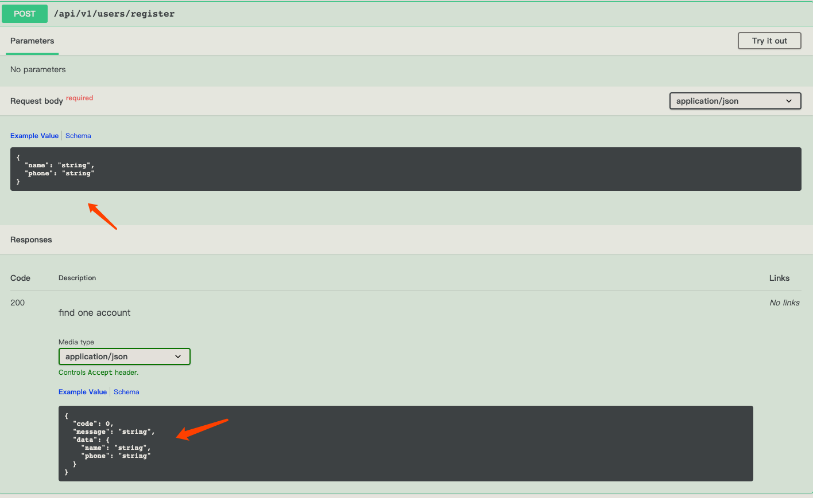

接下来我们将从一个请求开始说起，如何一步一步构架一个 Web 服务

本教程的完整示例见 [hello-world](https://github.com/kaolalicai/klg-nest-starter/tree/master/sample/hello-world)

## 先理解 Nest 的 Module
Nest 默认提供了 Module 模块的概念，在继续本教程之前，请务必理解 Nest 的 [Module](https://docs.nestjs.cn/7/modules)
其核心概念有：

- providers	由 Nest 注入器实例化的提供者，并且可以至少在整个模块中共享
- controllers	必须创建的一组控制器
- imports	导入模块的列表，这些模块导出了此模块中所需提供者
- exports	由本模块提供并应在其他模块中可用的提供者的子集。

假设一个场景，我们系统里定义两个 Module，UserModule 和 OrderModule.
在 UserModule 中我们定义了一个 UsersService
> users.module.ts
```ts
@Module({
  imports: [
    TypegooseModule.forFeature([User], 'core'),
  ],
  controllers: [UsersController],
  providers: [UsersService]，
  exports: [UsersService]
})
export class UsersModule {
}
```

如果我们要在 OrderModule 里使用 User 这个 UsersService 应该如何做呢？
前提是 UserModule 里必须把 UsersService 导出，然后在  OrderModule 里导入

> order.module.ts
```ts
@Module({
  imports: [
    UserModule,
    TypegooseModule.forFeature([Order], 'core'),
  ],
  controllers: [OrderController],
  providers: [OrderService]
})
export class OrderModule {
}
```
然后在 OrderService 中使用

TODO

## 定义一个路由
Nest 使用注解式路由

> cats.controller.ts

```ts
import { Controller, Get } from '@nestjs/common';

@Controller('cats')
export class CatsController {
  @Get()
  findAll(): string {
    return 'This action returns all cats';
  }
}
```

请求参数则通过 @Query @Body 等方式获取，具体见 [Nest文档](https://docs.nestjs.cn/7/controllers)


## 参数校验 DTO
在 Nest 框架中，最好使用 DTO 对象来完成参数的校验.

例如在一个注册 register 接口中，我们将会定义一个 UserDto 对象表示注册需要的参数。

> src/users/users.dto.ts
```ts
import { IsNotEmpty } from 'class-validator'
import { BaseResponse } from '@kalengo/web'

export class UserDto {
  @IsNotEmpty()
  readonly name!: string
  @IsNotEmpty()
  readonly phone!: string
}
```

而且我们还在具体的属性上加了 @IsNotEmpty() 的注解，这样 Nest 就会自动帮你完成参数校验。

使用 DTO 的另一个好处： DTO 作为一个 class 定义的，可以方便地继承和重用

更多细节请看 Nest 官方文档 [类验证器](https://docs.nestjs.cn/7/pipes?id=%e7%b1%bb%e9%aa%8c%e8%af%81%e5%99%a8)

## 集合参数(TODO)
在之前的开发经验中，为了方便处理参数，我们希望把 query body 的参数集合到一个对象 parameters 中,
我们可以通过一个中间件来实现

## Request Log
Nest 默认不提供 Request Log 的中间件，我们可以使用开源的 express 中间件 morgan，在 main.ts 中挂载即可

```ts
import {NestFactory} from '@nestjs/core'
import * as morgan from 'morgan'
import {ApplicationModule} from './app.module'

async function bootstrap () {
  const app = await NestFactory.create(ApplicationModule)
  // request log
  app.use(morgan('tiny'))
  await app.listen(process.env.PORT || 3000)
  console.log(`Application(${ process.env.NODE_ENV }) is running on: ${ await app.getUrl() }`)
}

```

如果你有更复杂的日志需求，例如 log 存储分割等问题，请查阅本脚手架的[日志说明文档](https://kaolalicai.github.io/nest_doc/extend/logger.html)

## Response Format
实际业务中，我们需要统一接口的返回值，Nest 默认不提供此类中间件，我们可以自己实现一个，如何编写中间件，请看 [Nest文档](https://docs.nestjs.cn/7/middlewares)

> transform.interceptor.ts

```ts
import {Injectable, NestInterceptor, CallHandler, ExecutionContext} from '@nestjs/common'
import {map} from 'rxjs/operators'
import {Observable} from 'rxjs'

interface Response<T> {
  data: T
}

@Injectable()
export class TransformInterceptor<T> implements NestInterceptor<T, Response<T>> {
  intercept (context: ExecutionContext, next: CallHandler<T>): Observable<Response<T>> {
    return next.handle().pipe(
      map(data => {
        return {
          data,
          code: 0,
          message: 'success'
        }
      })
    )
  }
}
```

中间件写好了之后，在 app.module.ts 中全局挂载即可
> src/app.module.ts
```ts
import { Module } from '@nestjs/common'
import { UsersModule } from './users/users.module'
import { APP_INTERCEPTOR } from '@nestjs/core'
import { TransformInterceptor } from '@kalengo/web'

@Module({
  imports: [UsersModule],
  providers: [
    {
      provide: APP_INTERCEPTOR,
      useClass: TransformInterceptor
    }
  ]
})
export class ApplicationModule {}

```

**注意** 此类通用的中间件，我们会放入 @klg/web 包中

## 统一的异常处理

在 AppModule 注册全局的异常拦截器

```ts
import { Module } from '@nestjs/common'
import { APP_FILTER } from '@nestjs/core'
import { HttpExceptionFilter } from '@kalengo/web'

@Module({
  imports: [UsersModule],
  providers: [
    {
      provide: APP_FILTER,
      useClass: HttpExceptionFilter
    }
  ]
})
export class ApplicationModule {}
```

注意这种写法是和下面的 useGlobalFilters 效果一致的，不过 useClass 方式可以注入其他实例。

```ts
async function bootstrap() {
  const app = await NestFactory.create(AppModule);
  app.useGlobalFilters(new HttpExceptionFilter());
  await app.listen(3000);
}
bootstrap();
```

HttpExceptionFilter 默认拦截所有异常，并返回如下结构的 json 内容

```ts
{
"message": "Business Error",
"code": 1,
"url": "/api/v1/xxx/xxx"
}
```

配置好了拦截器，我们测试一下异常的情况，在 Controller 中抛出异常

```ts
import { Controller, Get } from '@nestjs/common'
import { BusinessException } from '@kalengo/web'

@Controller('users')
export class UsersController {

  @Get('/err')
  async err(): Promise<string> {
    throw new BusinessException()
  }
}

```

`@kalengo/web` 为大家提供了一个 BusinessException 对象，实际上是继承与 Nest 的 HttpException, 这里抛出的异常将会被我们配置的拦截器拦截并处理。

我们可以根据业务需要编写更多的自定义异常。

更多详细内容请查阅 [Nest文档](https://docs.nestjs.cn/7/exceptionfilters)

## 接口文档 Swagger

Nest 对 Swagger 有着非常好的集成，我们可以用注解的方式，直接在代码上编写接口文档。

还是以注册接口为例，看看如何编写接口文档。

> src/users/users.controller.ts

```ts

@Controller('users')
export class UsersController {
  constructor(private readonly usersService: UsersService) {}

  @Post('/register')
  @ApiOkResponse({
    description: 'find one account',
    type: RegisterRes
  })
  async register(@Body() createUserDto: UserDto) {
    return await this.usersService.register(createUserDto)
  }
}

```

在 Controller 中，我们声明了 register 所需要的参数是 UserDto，返回值是 ApiOkResponse 里声明的 RegisterRes

这两个类型实际定义在 DTO 文件中

> src/users/users.dto.ts
```ts
import { IsNotEmpty } from 'class-validator'
import { ApiProperty } from '@nestjs/swagger'
import { BaseResponse } from '@kalengo/web'

export class UserDto {
  @IsNotEmpty()
  @ApiProperty()
  readonly name!: string
  @IsNotEmpty()
  @ApiProperty()
  readonly phone!: string
}

export class RegisterRes extends BaseResponse {
  @ApiProperty({ type: UserDto })
  readonly data!: UserDto
}
```

使用了 @ApiProperty 注解声明了 DTO 的字段，这些声明将会用于生成 Swagger 文档.

**注意**，DTO 每个字段都需要注释还是比较麻烦的，Nest Swagger 为了解决这个问题，提供了自动扫描插件，
该插件会尝试读取 typescript 信息，自动生成 API 文档需要的信息，详情见 [插件文档](https://docs.nestjs.cn/7/recipes?id=%e6%8f%92%e4%bb%b6)

最终，生成好的接口文档长这样:



可以看到，参数类型和返回值类型都被准确声明了。

后端开发可以先写好接口设计，然后使用这份文档和前端沟通

更多细节请看 Nest 官方文档 [OpenAPI (Swagger)](https://docs.nestjs.cn/7/recipes?id=openapi-swagger)

